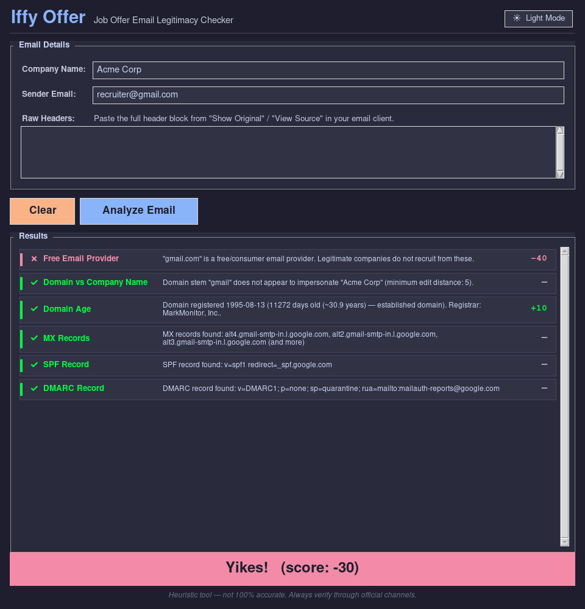
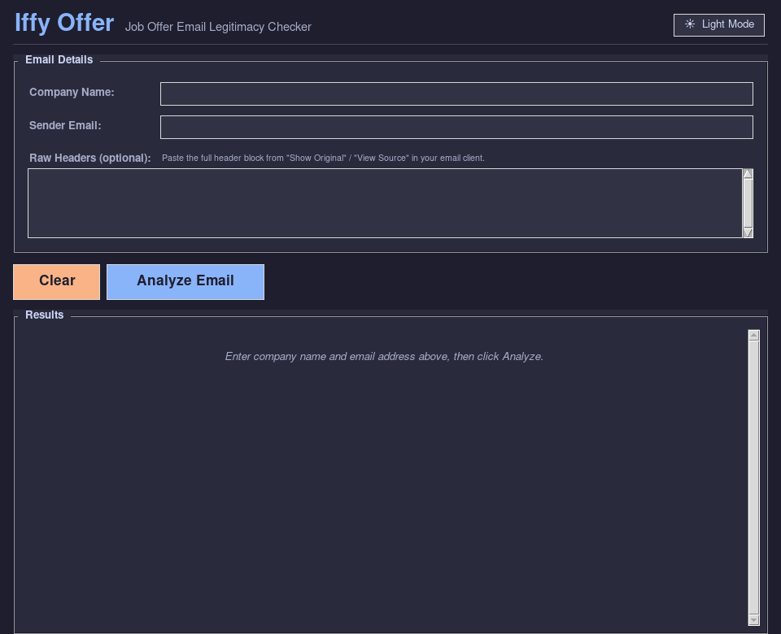
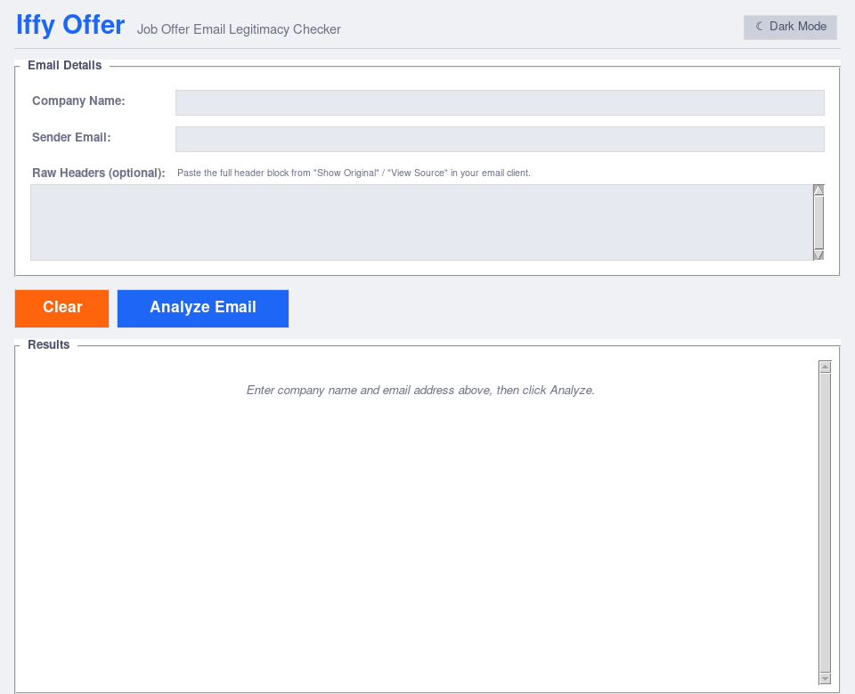

# 🕵️ Iffy_Offer — Job Offer Email Legitimacy Checker

[](https://github.com/cainepavl/Iffy_Offer/releases)
[](LICENSE)
[]()
[]()
[]()



A desktop tool that analyzes a job-offer email and estimates whether it's from
a legitimate company or a phishing/scam attempt.

Enter the company name and the sender's email address (and optionally paste the
raw email headers), click **Analyze**, and get a risk verdict in seconds.

---

## 💡 Why I built this

I kept getting job-offer emails that felt off — free-provider addresses claiming
to be from Fortune 500 companies, brand-new domains with no email infrastructure,
display names that didn't match the actual sender. I wanted a quick way to
sanity-check them without manually digging through DNS records and WHOIS every
time. Iffy Offer automates those checks and gives a plain-English verdict in a
few seconds. It won't catch every scam, but it catches the obvious ones fast.

---

## ✨ Features

- **Domain analysis** — detects homoglyph substitutions (`amaz0n.com`) and
  typosquatted domains (`amzon-careers.com`)
- **Free-provider detection** — flags addresses from Gmail, Yahoo, Hotmail, etc.
- **ATS platform recognition** — recognizes legitimate recruiting platforms
  (Greenhouse, Workday, Lever, LinkedIn, etc.)
- **Domain age check** — WHOIS lookup flags brand-new domains (< 30 days)
- **DNS record checks** — verifies MX, SPF, and DMARC records
- **Header analysis** — detects display-name spoofing and Reply-To hijacking
  (when raw headers are provided)
- **Risk score** — all signals combine into a single score with a color-coded verdict
- **Dark & light mode** — toggle with one click; high-contrast palette with Matrix-green pass indicators in both modes
- **Larger default window** — results panel sized to show all checks without scrolling

---

## 📸 Screenshots

| Dark Mode | Light Mode |
|-----------|------------|
|  |  |

---

## 🛠️ Installation

**Requirements:** Python 3.10 or newer

### 1. 🐍 Verify your Python version

```bash
python3 --version
```

If the output is below `3.10`, [download a newer release from python.org](https://www.python.org/downloads/) before continuing.

### 2. 📥 Clone the repository

```bash
git clone https://github.com/cainepavl/Iffy_Offer.git
cd Iffy_Offer
```

### 3. 📦 Create and activate a virtual environment (recommended)

```bash
python3 -m venv venv
```

```bash
# Linux / macOS
source venv/bin/activate

# Windows — PowerShell
venv\Scripts\Activate.ps1

# Windows — Command Prompt
venv\Scripts\activate.bat
```

Your prompt will change to show `(venv)` when the environment is active.

### 4. ⬇️ Install dependencies

```bash
pip install -r requirements.txt
```

### 5. ▶️ Launch the app

```bash
python main.py
```

---

### 📝 Tkinter note

Tkinter is part of the Python standard library and is included automatically on Windows (via the python.org installer) and macOS. On Linux it may need to be installed separately:

```bash
# Debian / Ubuntu
sudo apt install python3-tk

# Fedora
sudo dnf install python3-tkinter

# macOS (if missing after a Homebrew Python install)
brew install python-tk
```

### 🐧 WSL (Windows Subsystem for Linux)

Iffy Offer opens a GUI window, so WSL needs a display backend to render it.

**Windows 11 — WSL 2 with WSLg (recommended)**  
WSLg ships built into Windows 11 (21H2 and later) and handles GUI apps automatically. Follow the Linux installation steps above — no extra display setup needed.

**Windows 10 — WSL 2 without WSLg**  
Install an X server on the Windows side (e.g. [VcXsrv](https://sourceforge.net/projects/vcxsrv/)), launch it with "Disable access control" checked, then export the display variable before running the app:

```bash
export DISPLAY=$(grep nameserver /etc/resolv.conf | awk '{print $2}'):0.0
python main.py
```

> Also make sure `python3-tk` or `python3-tkinter` is installed inside your WSL distro — see the Tkinter note above.

---

## 🚀 Usage

1. **Company Name** — type the name of the company that supposedly sent the email
   (e.g. `Amazon`, `Google`, `Acme Corp`)

2. **Sender Email** — paste the *full* From address, including display name if shown
   (e.g. `Amazon Recruiting <hr@amaz0n-careers.net>`)

3. **Raw Headers** — paste the full header block from your email client ("Show Original" /
   "View Source") into the text area. This is optional but enables display-name spoofing
   and Reply-To mismatch checks.

4. Click **Analyze Email** and wait a few seconds for DNS/WHOIS lookups to complete.

---

## 🔍 Finding the Raw Header Block

The raw header block is the machine-readable metadata that sits above the email
body. Every email has one; it's just hidden by default.

### 📬 How to open it in common clients

| Client              | Steps                                                                                                |
| ------------------- | ---------------------------------------------------------------------------------------------------- |
| **Gmail** (web)     | Open the email → click the **⋮** (three-dot) menu at the top right → **Show original**             |
| **Outlook** (web)   | Open the email → click **⋯** → **View** → **View message source**                                  |
| **Outlook** (desktop) | Open the email in its own window → **File** → **Properties** → look in the *Internet headers* box |
| **Apple Mail**      | Open the email → **View** menu → **Message** → **Raw Source**                                       |
| **Thunderbird**     | Open the email → **View** menu → **Message Source** (or `Ctrl+U`)                                   |
| **Yahoo Mail**      | Open the email → click the **⋯** menu → **View Raw Message**                                        |

### ✂️ What to copy

Once the raw source is open you will see something like this at the very top:

```text
Delivered-To: you@example.com
Received: from mail.sender.com ...
DKIM-Signature: v=1; a=rsa-sha256; c=relaxed/relaxed; d=sender.com;
        h=from:to:subject:date; bh=...; b=...
From: "HR Team" <hr@sender.com>
To: you@example.com
Subject: Exciting Opportunity
Date: Fri, 06 Jun 2026 10:00:00 +0000
Reply-To: different@otherdomain.com
...
```

Copy everything from the **very first line** down to (but not including) the blank
line that separates the headers from the email body. Paste that block into the
**Raw Headers** field in Iffy Offer.

> **Tip:** The header block always ends at the first completely blank line. Everything
> after that blank line is the body of the email — you don't need it.

---

## 📊 How Scoring Works

Each check contributes a signed integer delta to a cumulative risk score.

| Check                            | Score delta |
| -------------------------------- | :---------: |
| Free email provider (gmail, etc) |    –40      |
| Known ATS / recruiter platform   |    +20      |
| Homoglyph characters in domain   |    –30      |
| Typosquatting detected           |    –25      |
| Domain < 30 days old             |    –30      |
| Domain 30–180 days old           |    –15      |
| Domain > 2 years old             |    +10      |
| No MX records                    |    –20      |
| No SPF record                    |    –10      |
| No DMARC record                  |    –10      |
| Reply-To domain mismatch         |    –20      |
| Display name spoofing            |    –15      |

**Verdict bands:**

| Score      | Verdict          |
| ---------- | ---------------- |
| ≥ 0        | 🟢 Looks Legit   |
| –1 to –29  | 🟡 Iffy          |
| ≤ –30      | 🔴 Yikes!        |

---

## 🚫 What This Tool Does NOT Do

- **Does not open, scan, or execute attachments** — attachment inspection would
  require sandboxing that is beyond this tool's scope.
- **Does not follow or analyze links** in the email body.
- **Does not contact the company** to verify the recruiter's identity.
- **Does not send your data anywhere** — the only outbound network calls are
  standard DNS and WHOIS queries for the domain you enter. No email content,
  no personal information, and no usage data is ever transmitted.
- **Cannot guarantee accuracy** — a well-resourced attacker can pass some of
  these checks (e.g. by setting up SPF/DMARC on a fake domain). Use this tool
  as one input among several, not as a definitive verdict.

---

## ⚠️ Limitations

- WHOIS lookups can fail for some TLDs (privacy shields, unsupported registries).
  The tool will show "unknown" for age rather than error out.
- DNS checks require an internet connection.
- The ATS platform and free-provider lists are curated manually — they may not
  cover every service.

---

## 🔧 Extending

To add a new free provider or ATS platform, just add a line to
`data/free_providers.txt` or `data/ats_platforms.txt`. No code changes required.

To add a new check, see the **Adding a New Check** section in `CLAUDE.md`.

---

## 📄 License

**MIT License** — Copyright (c) 2026 Caine Pavlosky

You are free to use, copy, modify, and distribute this software for any
purpose, with or without modification, as long as the copyright notice and
permission notice are preserved. See the [`LICENSE`](LICENSE) file for the
full license text.

---

## 🔔 Disclaimer

Iffy Offer is provided for **educational and personal use only**. It is a
heuristic tool and is **not 100% accurate** — a sophisticated attacker can
pass some checks (e.g. by registering a domain with proper SPF/DMARC records).
Always verify suspicious emails through official company channels before
taking any action. This tool does not constitute legal, security, or
professional advice.

---

## 📩 Contact/Connect

**Caine Pavlosky**

* Email: [cainepavl@outlook.com](mailto:cainepavl@outlook.com)
* Portfolio: [fairdinkumstudios.com](https://fairdinkumstudios.com/)
* LinkedIn: [linkedin.com/in/cainepavlosky008](https://linkedin.com/in/cainepavlosky008)
